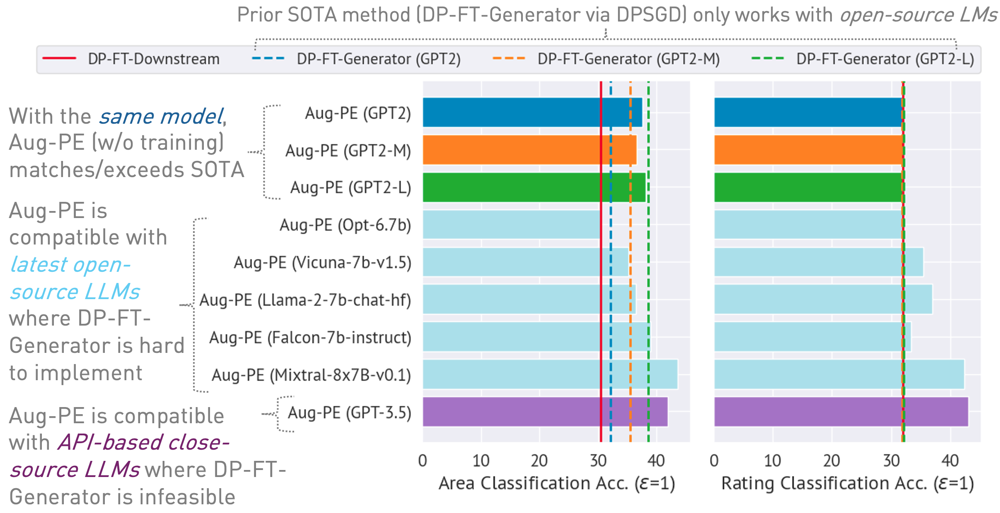

<h1 align="center"> Differentially Private Synthetic Data via Foundation Model APIs 2: Text</h1>

<p align="center">
<a href="https://arxiv.org/abs/2403.01749">📃 Paper</a>
•
<a href="https://github.com/AI-secure/aug-pe/tree/main/data" > Data (Yelp/OpenReview/PubMed)</a>
<!-- •
<a href="" >Project Page</a> -->
</p>


This repository implements the Augmented Private Evolution (Aug-PE) algorithm, leveraging inference API access to large language models (LLMs) to generate differentially private (DP) synthetic text without the need for model training. We compare DP-SGD finetuning and Aug-PE:

<p align="center">
  
</p>


 Under $\epsilon=1$, Aug-PE produces DP synthetic text that yields competitive utility with the SOTA DP-SGD finetuning baselines on OpenReview data.


<p align="center">
  
</p>


## News


* `03/11/2024`: Code and ArXiv paper are available.


## Setup
### Environment setup

```
conda env create -f environment.yml
conda activate augpe
```

### Data Preparation

Datasets are located at  `data/{dataset}` where `dataset` is `yelp`,  `openreview` and `pubmed`.

Download the Yelp `train.csv` (1.21G)  and PubMed `train.csv` (117MB)  from [this link](https://drive.google.com/drive/folders/1oSICwgCAqdxEz4mF5ZK863RoN5sxMB_0?usp=sharing) or execute:
```bash 
bash scripts/download_data.sh # download yelp train.csv and pubmed train.csv
```


### Generating Private Data Embeddings

Pre-compute embeddings for private data (line 1 in Aug-PE algorithm):
```bash  
bash scripts/embeddings.sh --openreview  # Compute private embeddings  
bash scripts/embeddings.sh --pubmed      
bash scripts/embeddings.sh --yelp       
```
Note: Computing embeddings for OpenReview and PubMed is relatively quick. However, due to Yelp's large dataset size (1.9M training samples), the process may take approximately 40 minutes.


### Calculating the Noise Level Under $\epsilon$ privacy budget
Calculate the DP noise level for your dataset in `notebook/dp_budget.ipynb` given the privacy budget $\epsilon$. 
To achieve $\epsilon=1,2,4$ under 10 epochs,  we set noise level 
[15.34, 8.03, 4.24] for yelp,
[11.60, 6.22, 3.38] for openreview,
[13.26, 7.01, 3.75] for pubmed. 


### Wandb
 
For visualization with Wandb, configure your `--wandb_key` and `--project` with your key and project name in `dpsda/arg_utils.py`.


## 🚀 Run (open-source LLMs)

### 📂 Generate DP Synthetic Text with Aug-PE

Utilize open-source LLMs from Hugging Face to generate synthetic data:
```bash 
export CUDA_VISIBLE_DEVICES=0 
bash scripts/hf/{dataset}/generate.sh  # Replace `{dataset}` with yelp, openreview, or pubmed
```
Some key hyperparameters: 
- `noise`: DP noise.
- `epoch`: we use 10 epochs for DP setting. For non-DP setting, we use 20 epochs for Yelp and 10 epochs for other datasets. 
- `model_type`: model on huggingface, such as ["gpt2", "gpt2-medium", "gpt2-large", "meta-llama/Llama-2-7b-chat-hf", "tiiuae/falcon-7b-instruct", "facebook/opt-6.7b", "lmsys/vicuna-7b-v1.5", "mistralai/Mixtral-8x7B-Instruct-v0.1"].
- `num_seed_samples`: number of synthetic samples. 
- `lookahead_degree`: number of variations for synthetic sample embedding estimation (line 5 in Aug-PE algorithm). Default is 0 (self-embedding).
- `L`: related to the number of variations to generate candidate synthetic samples (line 18 in Aug-PE algorithm)
- `feat_ext`: embedding model on [huggingface sentence-transformers](https://huggingface.co/sentence-transformers).
- `select_syn_mode`: select synthetic samples according to distance ranking or probability. Default is `rank` (line 19 in Aug-PE algorithm)
- `temperature`: temperature for LLM generation.


### 📊 Evaluate DP Synthetic Text 
#### Accuracy on Downstream Tasks
Finetune the downstream model with DP synthetic text and evaluate the model's accuracy on real test data:
```bash 
bash scripts/hf/{dataset}/downstream.sh # Finetune downstream model and evaluate performance
```
#### Similary between Synthetic and Real Data
Measure the embedding distribution distance:
```bash 
bash scripts/hf/{dataset}/metric.sh  # Calculate distribution distance
```

### Comprehensive End-to-End Scripts
For a streamlined process that combines all generation and evaluation steps:
```bash 
bash scripts/hf/template/{dataset}.sh # Complete workflow for each dataset
```

## 🚀 Run (closed-source LLMs)

### End-to-End Scripts

We use closed-source model via Azure OpenAI API. Please set your key and endpoint in `apis/azure_api.py` 
```python
MODEL_CONFIG={
        'gpt-3.5-turbo':{ "openai_api_key":  "YOUR_AZURE_OPENAI_API_KEY",
                            "openai_api_base": "YOUR_AZURE_OPENAI_ENDPOINT",
                            "engine": 'YOUR_DEPLOYMENT_NAME',
                            },
    }
```
Here `engine` could be `gpt-35-turbo` in [Azure](https://learn.microsoft.com/en-us/azure/ai-services/openai/quickstart?tabs=command-line,python&pivots=programming-language-python).


Run the following script to generate synthetic data,  evaluate it on downstream task and calculate embedding distribution distance between real and synthetic data: 
```bash 
bash scripts/gpt-3.5-turbo/{dataset}.sh
```

We use text-length related prompts for GPT-3.5 to control the length of the generated text. We introduce several additional hyperparameters here:
- `dynamic_len` is used to enbale the dynamic length mechanism.
- `word_var_scale`:  Gaussian noise variance used to determine targeted_word.  
- `max_token_word_scale`: max number of tokens per word. We set the max_token for LLM generation based on the targeted_word (specificed in the prompt) and  max_token_word_scale. 


Use the notebook to calculate the text length distribution difference between real and synthetic data:  `notebook/text_lens_distribution.ipynb`


## Acknowledgement

- [microsoft/DPSDA](https://github.com/microsoft/DPSDA)
- [microsoft/dp-transformers](https://github.com/microsoft/dp-transformers/tree/main/research/synthetic-text-generation-with-DP)


## 📚 Citation
If you find our work helpful, please consider citing it as follows:
```bibtex
@misc{xie2024differentially,
      title={Differentially Private Synthetic Data via Foundation Model APIs 2: Text}, 
      author={Chulin Xie and Zinan Lin and Arturs Backurs and Sivakanth Gopi and Da Yu and Huseyin A Inan and Harsha Nori and Haotian Jiang and Huishuai Zhang and Yin Tat Lee and Bo Li and Sergey Yekhanin},
      year={2024},
      eprint={2403.01749},
      archivePrefix={arXiv},
      primaryClass={cs.CL}
}
```


## Questions
If you have any questions related to the code or the paper, feel free to email Chulin (chulinx2@illinois.edu) or open an issue.


